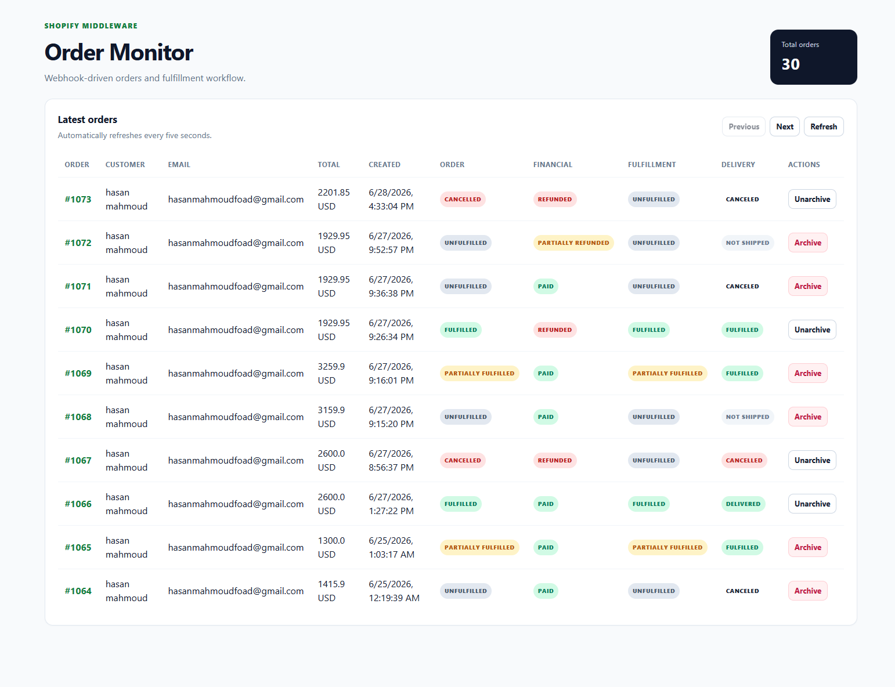
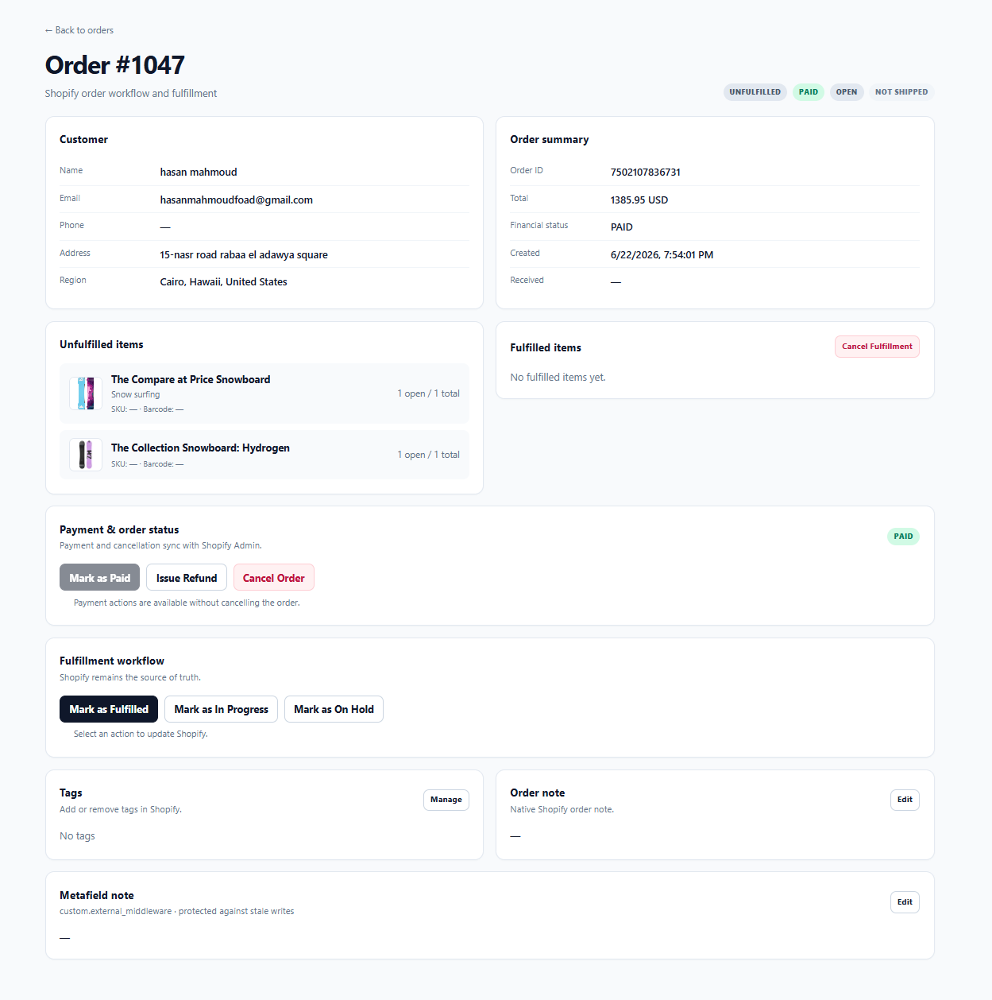

# Shopify Order Middleware Dashboard

A lightweight Express.js middleware built for learning and experimenting with the Shopify Admin GraphQL API, Webhooks, Fulfillment workflows, Refunds, and ERP-style integrations.

This project focuses on the backend side of Shopify development rather than storefront development. It demonstrates how Shopify communicates with external systems through webhooks and GraphQL APIs while providing a simple dashboard for monitoring and managing orders.

---

# Screenshots

> Replace the image paths below with your own screenshots.

## Dashboard



## Order Details



---

# Project Goals

This project was built to understand real-world Shopify integrations and middleware architecture.

Instead of focusing on storefront customization, this project demonstrates how to:

* Receive Shopify Webhooks
* Work with the Shopify Admin GraphQL API
* Manage Orders
* Handle Fulfillment workflows
* Issue Refunds
* Archive / Unarchive Orders
* Manage Order Notes
* Manage Order Tags
* Work with Shopify Metafields
* Build middleware that can later integrate with ERP, WMS, CRM, Shipping Providers, and other business systems

---

# Features

* Shopify Admin GraphQL API integration
* Shopify Webhooks (`orders/create`)
* Order monitoring dashboard
* Automatic startup synchronization with Shopify
* Cursor-based pagination (10 orders per page)
* Order details page
* Archive / Unarchive orders
* Order cancellation
* Mark orders as paid
* Partial and full fulfillment
* Fulfillment cancellation
* Fulfillment hold / release
* Fulfillment in-progress workflow
* Refund preview
* Line-item refunds
* Refund notes
* Optional restocking
* Restock location selection
* Order notes
* Order tags
* Custom metafield support (`custom.external_middleware`)
* Cloudflare Tunnel support for local webhook testing

---

# Architecture

```text
                    Customer
                        │
                        ▼
                 Shopify Store
                        │
                        ▼
                 Shopify Webhooks
                        │
                        ▼
             Express Middleware Server
                        │
        ┌───────────────┴────────────────┐
        │                                │
        ▼                                ▼
 Dashboard UI               Shopify Admin GraphQL API
                                     │
                                     ├── Orders
                                     ├── Fulfillment
                                     ├── Refunds
                                     ├── Notes
                                     ├── Tags
                                     ├── Metafields
                                     └── Order Actions
```

Shopify remains the source of truth. The middleware receives events from Shopify, performs business logic, communicates with the Shopify Admin GraphQL API, and updates the dashboard accordingly.

---

# Tech Stack

* Node.js
* Express.js
* Shopify Admin GraphQL API
* Shopify Webhooks
* HTML
* CSS
* Vanilla JavaScript
* Cloudflare Tunnel

---

# Environment Variables

Create an `app.env` file in the project root.

```env
SHOPIFY_STORE=your-store.myshopify.com

SHOPIFY_API_VERSION=2026-04

SHOPIFY_ACCESS_TOKEN=your_admin_api_access_token

SHOPIFY_ACCESS_TOKEN_EXPIRES_AT=0

SHOPIFY_CLIENT_ID=your_client_id

SHOPIFY_CLIENT_SECRET=your_client_secret

GRANT_TYPE=client_credentials

PORT=3000
```

Notes:

* Never commit your credentials.
* Never hardcode Shopify tokens.
* Add `app.env` to `.gitignore`.

---

# Shopify App Requirements

Create a Shopify App from the Shopify Partner Dashboard and install it on your development store.

The application currently requires Admin API scopes similar to:

* read_orders
* write_orders
* read_customers
* read_fulfillments
* write_fulfillments
* write_merchant_managed_fulfillment_orders
* read_locations

Additional scopes may be required as new features are implemented.

---

# Protected Customer Data

Some customer fields are protected by Shopify.

Examples include:

* Customer Email
* Customer Phone
* Customer Address
* Other sensitive customer information

Even if your app has `read_orders` or `read_customers`, Shopify may still return:

```text
ACCESS_DENIED
```

for protected customer fields until your application has been approved for Protected Customer Data access through the Shopify Partner Dashboard.

For local development or learning purposes, remove protected fields from your GraphQL queries if approval has not been granted.

---

# Local Development

Install dependencies:

```bash
npm install
```

Start the application:

```bash
npm start
```

or

```bash
npm run dev
```

Open the dashboard:

```text
http://localhost:3000
```

---

# Webhook Configuration

Expose your local server using Cloudflare Tunnel:

```bash
npx cloudflared tunnel --url http://localhost:3000
```

Create a Shopify webhook:

* Topic: `orders/create`
* Method: POST

Webhook URL:

```text
https://your-tunnel.trycloudflare.com/webhooks/orders-create
```

---

# Main API Routes

| Route                                                   | Description                 |
| ------------------------------------------------------- | --------------------------- |
| GET /                                                   | Dashboard                   |
| GET /orders/:id                                         | Order Details               |
| GET /api/orders                                         | Paginated Orders            |
| GET /api/orders/:id                                     | Refresh Order               |
| POST /api/orders/:id/archive                            | Archive Order               |
| POST /api/orders/:id/unarchive                          | Unarchive Order             |
| POST /api/orders/:id/cancel                             | Cancel Order                |
| POST /api/orders/:id/mark-paid                          | Mark Order as Paid          |
| POST /api/orders/:id/fulfill                            | Create Fulfillment          |
| POST /api/orders/:id/fulfillments/:fulfillmentId/cancel | Cancel Fulfillment          |
| POST /api/orders/:id/status                             | Hold / In Progress          |
| POST /api/orders/:id/release                            | Release Hold                |
| POST /api/orders/:id/refund                             | Create Refund               |
| GET /api/orders/:id/refund-preview                      | Refund Preview              |
| POST /api/orders/:id/note                               | Update Order Note           |
| POST /api/orders/:id/tag                                | Add Tag                     |
| DELETE /api/orders/:id/tag                              | Remove Tag                  |
| POST /api/orders/:id/metafield                          | Update Middleware Metafield |
| GET /api/locations                                      | List Shopify Locations      |

---

# Refund Requirements

A Shopify order can only be refunded when:

* The order contains a successful payment transaction.
* The refund amount does not exceed Shopify's refundable balance.
* The payment gateway supports refunds.
* The order has not been cancelled or voided.
* A valid Shopify location is supplied when restocking inventory.

The middleware uses Shopify's GraphQL `refundCreate` mutation with an idempotency key to avoid duplicate refund requests.

---

# Testing

Recommended manual testing flow:

* Start the Express server.
* Start Cloudflare Tunnel.
* Register the Shopify webhook.
* Create a Shopify order.
* Verify that the order appears in the dashboard.
* Open the order details page.
* Test archive / unarchive.
* Test fulfillment workflow.
* Test refund preview.
* Test refund creation.
* Test pagination.
* Verify Shopify Admin reflects every action correctly.

---

# Current Limitations

* Uses in-memory storage only.
* Data resets whenever the server restarts.
* Dashboard authentication has not yet been implemented.
* HMAC webhook verification is not yet implemented.
* This project is intended for learning and experimentation.

---

# License

This project is intended for educational purposes to demonstrate Shopify middleware architecture, Shopify GraphQL, and webhook-driven integrations.
